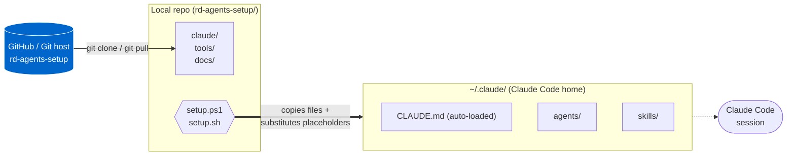

# AI R&D Squad — Claude Code Configuration

A portable, team-shareable Claude Code agent/skill/tool setup for software engineering squads.

---

## What this is

A centralized definition of all agents, skills, and tools used in Claude Code. Clone once, run setup, and everyone on the team gets the same configuration.

```
rd-agents-setup/
├── setup.ps1 / setup.sh        ← Deploy to ~/.claude/
├── claude/
│   ├── CLAUDE.md               ← Team manifest (auto-loaded every session)
│   ├── agents/                 ← Specialized agents (12)
│   ├── skills/                 ← Trigger-phrase skills (github-sync)
│   ├── commands/               ← Slash commands (/plan-feature, /build-feature, ...)
│   └── rules/                  ← Always-active engineering rules
├── tools/
│   └── templates/              ← BA document templates
└── docs/
    ├── AGENTS_REGISTRY.md      ← Offline registry (full team overview)
    ├── TECH_STACK.md           ← Canonical stack (referenced by all agents)
    ├── HANDOFF_PROTOCOL.md     ← File-based handoff via specs/
    └── PRE_IMPLEMENTATION_CHECKLIST.md  ← 5 questions for engineers
```

---

## How it works

### 1. Deploy flow



- Source of truth = this repo. Edit in `rd-agents-setup/claude/...`, NOT in `~/.claude/`.
- `setup.ps1` / `setup.sh` copies files to Claude Code home and replaces placeholders.

### 2. Agent Roster — who does what

#### Core workflow (3 phases, 2 gates)

| Agent | Domain | Phase |
|-------|--------|-------|
| **teamlead** | orchestration, pattern selection (1–4), Gate A/B enforcement | all |
| **business-analyst** | Lean Canvas, UAT, value scoring + PRD with Given/When/Then | Phase 1 step 1 |
| **software-architect** | system design, API contracts (OpenAPI 3.1), task breakdown, ADRs (sole owner of `implementation-tasks.json`) | Phase 1 step 2 |
| **developer** | implementation (Python/FastAPI primary, multi-language) | Phase 2 |
| **frontend-engineer** | frontend (React/TS/Zustand/TanStack) + configurable design system (dark/light themes) | Phase 2 |
| **code-reviewer** | post-implementation review, PASS/CONDITIONAL/FAIL + fix loop | Phase 2 |
| **tester** | unit/integration/E2E/contract tests with execution evidence (counts required) | Phase 2 |

#### Pattern 3 (Bug Fix) and Pattern 4 (Refactor) required

| Agent | Domain |
|-------|--------|
| **codebase-intelligence** | code analysis, drift detection, safe placement guidance |

#### On-demand specialists

| Agent | Domain |
|-------|--------|
| **llm-engineer** | LiteLLM gateway, RAG, prompts, vector store (runs BEFORE developer in Pattern 2) |
| **data-engineer** | ETL pipelines, OLAP schemas, vector ingestion |
| **docs-writer** | technical documentation in Markdown |
| **squad-configurator** | CREATE mode (new agents/skills/tools) + AUDIT mode (review existing) |

> Backend auth is handled by **developer**. Deployment artifacts are produced by `/ship` and pushed via **github-sync**; the actual deploy (Cloud Run, container host, PaaS) is run by you or your CI.

### 3. Slash commands

| Command | Maps to | What it does |
|---------|---------|-------------|
| `/spike <question>` | Spike | throwaway POC to test feasibility before planning — no contract, no gates |
| `/plan-feature <description>` | Phase 1 | business-analyst (PRD, **lean by default**) → software-architect (architecture + contract + task breakdown) → Gate A |
| `/build-feature [context]` | Phase 2 | engineers → code-reviewer (runs lint/typecheck/build, fix loop) → tester (+ e2e smoke) → Gate B → harvest |
| `/bugfix <description>` | Pattern 3 | codebase-intelligence → engineer → code-reviewer → tester |
| `/refactor <description>` | Pattern 4 | codebase-intelligence → software-architect → engineers → code-reviewer → tester |
| `/review-build` | Standalone | code-reviewer on current implementation |
| `/retro [scope]` | Harvest | distill `specs/journal.md` → lessons (project auto; global on approval) |
| `/ship` | Phase 3 | verify prerequisites → produce deployment artifacts → push via github-sync |
| `/save-session [name]` | Persist | snapshot to `specs/sessions/YYYY-MM-DD-<name>.md` |
| `/resume-session [name]` | Resume | reads session, shows state, asks "Continue?" |

> **Fast Path** (small, well-scoped tasks): teamlead runs a lighter flow with one confirm gate instead of two. Review + QA never skipped. Full path is the default.

### 4. Always-active rules

Auto-loaded from `~/.claude/rules/` every session:

| Rule | What it enforces |
|------|-----------------|
| `contract-first.md` | `api-contracts.yaml` as single source of truth |
| `security.md` | OWASP, no hardcoded secrets, parameterized queries, privacy compliance |
| `stack-compliance.md` | Canonical stack (LiteLLM, Provider Abstraction, error format, CSS variable design system); hosting/DB free choice, core framework via ADR |
| `workflow-discipline.md` | Task ownership, gates + fast-path, executive verification (reviewer runs build; tester runs smoke), run isolation, fix loop, evidence-only |
| `accessibility-i18n.md` | WCAG 2.1 AA, react-i18next (English default) |
| `self-improvement.md` | Journal during work → harvest into lessons; read lessons before starting |
| `learned-patterns.md` | Cross-project memory loaded every session (durable lessons for your domain) |

### 5. Self-improvement loop

Agents append gotchas/errors to `specs/journal.md` while working. At the end of a phase (or via `/retro`), teamlead distills them into lessons: **project lessons** auto-saved to `specs/lessons.md`, and **cross-project lessons** added to `rules/learned-patterns.md` **with your approval** (then `sync.ps1` to deploy). The system gets sharper on your kind of work with each project.

---

## Prerequisites

These are **one-time per machine** setups. Without them the agents and skills won't work against external APIs.

### 1. Claude Code installed

Install Claude Code from [claude.ai/code](https://claude.ai/code) or your organization's software portal. Verify:

```powershell
claude --version
```

### 2. Environment variables

Set this once (Windows User scope), then open a new PowerShell window:

```powershell
# GitHub token (for github-sync skill)
[Environment]::SetEnvironmentVariable('GITHUB_TOKEN', '<your-github-pat>', 'User')
```

### 3. Git config

```powershell
git config --global user.name  "Your Name"
git config --global user.email "you@example.com"
```

---

## First-time setup

### 1. Clone repo

```powershell
# Windows
git clone https://github.com/<your-org>/rd-agents-setup.git
cd rd-agents-setup

# Linux/macOS
git clone https://github.com/<your-org>/rd-agents-setup.git
cd rd-agents-setup
```

### 2. Run setup

```powershell
# Windows
.\setup.ps1

# Linux/macOS
chmod +x setup.sh
./setup.sh
```

The setup script:
- Copies `claude/CLAUDE.md`, `claude/agents/*`, `claude/skills/*`, `claude/commands/*`, `claude/rules/*` to `~/.claude/`
- Substitutes placeholders (`{{SQUAD_HOME}}`, `{{CLAUDE_HOME}}`) with actual paths
- Sets the `SQUAD_HOME` env var (used by tools)

### 3. Restart Claude Code

CLAUDE.md and agents will be loaded in the next session.

---

## Update workflow

```powershell
# After git pull:
.\setup.ps1

# Or combined:
git pull; .\setup.ps1
```

**Important:** All edits go in the **source files in the repo**, not directly in `~/.claude/`. The next `setup.ps1` run will overwrite any direct edits to deployed files.

---

## Customization

### Team identity
Edit `claude/CLAUDE.md` → Team Identity section.

### Design system
The `frontend-engineer` agent uses `--brand-accent` CSS variable. Set it in your project's root CSS to your brand color.

---

## Path placeholders

Source files in `claude/` use placeholders that setup replaces:

| Placeholder | Replaced with | Example |
|-------------|---------------|---------|
| `{{SQUAD_HOME}}` | Repo location | `C:\Users\<user>\Documents\rd-agents-setup` |
| `{{CLAUDE_HOME}}` | Claude config dir | `C:\Users\<user>\.claude` |

---

## What to sync, what not to

**Sync (in repo):**
- ✅ Agents, skills, CLAUDE.md, commands, rules (deploy targets)
- ✅ Tools (Python scripts, MD reference files, templates)
- ✅ Docs (AGENTS_REGISTRY.md, TECH_STACK.md, etc.)

**Do NOT sync (user-specific):**
- ❌ `~/.claude/settings.json` (CA bundle paths, env vars)
- ❌ `~/.claude/projects/.../memory/` (personal memory)
- ❌ `Manuals/` or similar output folders with generated docs
- ❌ `.env` files with credentials

---

## Adding a new agent / skill / tool

Invoke the `squad-configurator` agent:

```
> I need a new agent for <X>
```

Or manually:
1. Source: `claude/agents/<name>.md` (with placeholders)
2. Update `docs/AGENTS_REGISTRY.md`
3. Update `claude/CLAUDE.md` (Agent Roster)
4. Run `.\setup.ps1` locally
5. Commit + push

---

## Troubleshooting

**Agent file shows `{{SQUAD_HOME}}` in Claude Code** → setup wasn't run.
Run `.\setup.ps1` from the repo directory.

**`git pull` failed (merge conflict)** → resolve conflict before running setup.
```powershell
git status
# fix conflicts
git add .
git commit
.\setup.ps1
```

**Different team members have different `~/.claude/agents/*.md`** → someone is editing the deployed file instead of the source.
The repo is the single source of truth — always edit `claude/agents/*` in the repo.

---

## Tech stack reference

See `claude/CLAUDE.md` for the team manifest (FastAPI, LiteLLM, configurable design system, etc.).
See `docs/AGENTS_REGISTRY.md` for the full list of agents, skills, and tools.
